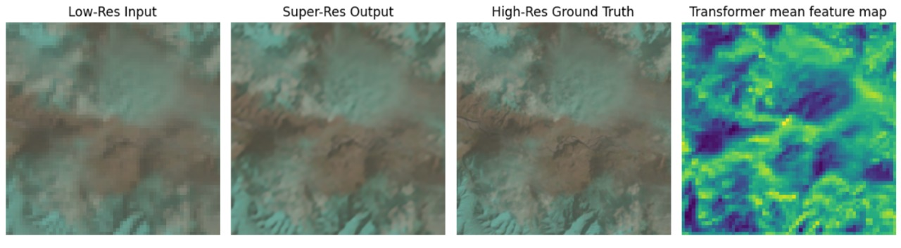
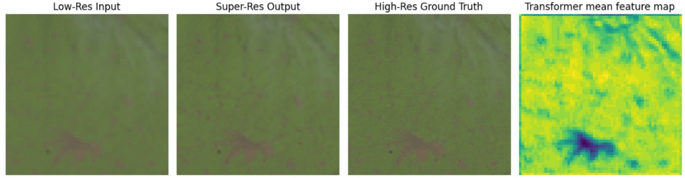
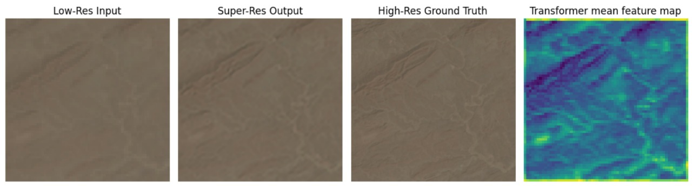
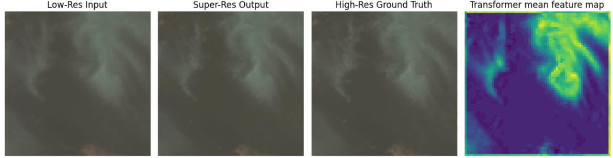
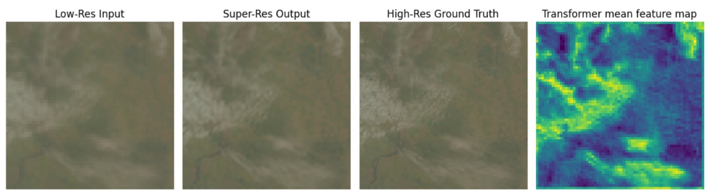
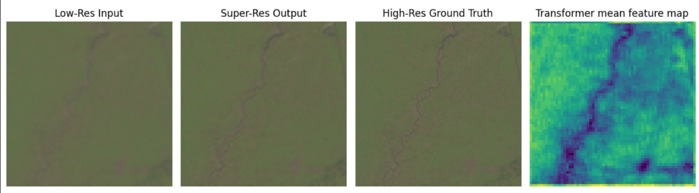

# Geological Features Informed Transformer-Based Super-Resolution of Satellite Imagery

> ✨ Made by [Himmat](https://github.com/H1mm4tHQ) and [Anoop](https://github.com/anoopElGato) as part of a research-driven academic project.

## 📌 Problem Statement

With the increasing use of high-resolution sensors, satellite image super-resolution (SR) has become crucial in remote sensing applications. Traditional interpolation techniques often fail to preserve detailed textures and structural nuances in satellite images. Deep learning methods such as CNNs and GANs (e.g., ESRGAN) have made significant progress, yet they often rely solely on low-resolution (LR) inputs and ignore the contextual terrain information essential for accurate enhancement.

This project addresses that limitation by proposing a **Transformer-based super-resolution model** that incorporates **auxiliary geological features**—including depth maps, thermal heat maps, and multi-modal satellite inputs. The model uses **cross-modality attention** to guide upsampling based on the **spatial and geological relevance** of features. This allows for improved reconstruction of semantically significant regions like rivers, mountains, and urban zones, making the output suitable for applications such as urban planning, land cover classification, and environmental monitoring.

---

## ⚙️ Proposed Method

We introduce a **multi-stream transformer architecture** that fuses RGB images with geological modalities (QuickBird Panchromatic and Thermal Infrared data). The model leverages both **global attention mechanisms** and **local convolutional refinement** to enhance satellite images.

### 🛰️ Dataset Collection and Preparation

- **Source**: Sourced from [USGS Earth Explorer](https://earthexplorer.usgs.gov)
- **Data Types**:
  - `Normal`: RGB low-resolution terrain-corrected images.
  - `QB`: QuickBird multispectral (panchromatic) images.
  - `TIR`: Thermal Infrared images.
- **Region**: North India for some coludy region.
- **Preprocessing**:
  - Removed cloud coverage >30%.
  - Reprojected and aligned tilted satellite tiles (7561×7721).
  - Cropped to 800×800 patches across all modalities.
  - Downsampled to 64×64 to reduce GPU memory usage.
  - Applied normalization and data augmentation.
  - Dataset split: **90% training, 10% validation**.

---

## 🧠 Model Architecture

### 🔗 Input Modalities:

- **RGB** (LR image)
- **QB** (QuickBird)
- **TIR** (Thermal Infrared)

These three aligned inputs are passed through different streams and merged using attention.

### 🧩 Key Components:

1. **Patch Embedding**: Each modality is passed through CNN layers to generate spatial embeddings.
2. **Positional Encoding**: Provides spatial awareness to the transformer by encoding the position of each patch.
3. **Cross-Modality Attention**:
   - RGB features act as **queries**.
   - QB and TIR features serve as **keys** and **values**.
   - Allows the RGB stream to attend to geologically informative regions.
4. **Transformer Blocks**:
   - Capture global dependencies.
   - Combine with local CNN blocks for fine-detail enhancement.
5. **Dense Residual Blocks**:
   - Enable feature reuse.
   - Help learn detailed textures.
6. **Fusion Module**:
   - Merges global and local features.
   - Uses 1×1 convolution for dimensionality reduction.
7. **Progressive Upsampling**:
   - Combines bilinear interpolation with convolution.
   - Shortcut paths maintain structure while adding texture.

---

## 🏗️ Generator Design

- **Input**: 9-channel tensor (3 for RGB + 3 for QB + 3 for TIR).
- **Two parallel branches**:
  1. Transformer-based context extraction.
  2. Shallow CNN processing of LR input.
- **Residual Fusion Blocks**:
  - Combine transformer and CNN features.
  - Refine details iteratively.
- **Upsampling Path**:
  - Residual Upsample Blocks to upscale image step-by-step.
- **Output**: Final 3-channel high-resolution RGB image.

---

## 📸 Sample Outputs

Each result image below shows, from left to right:
**Low-Res Input → Super-Resolved Output → Ground Truth → Transformer Attention Heatmap**

| Sample Results            |
| ------------------------- |
|  |
|  |
|  |
|  |
|  |
|  |

---

## 🧪 Applications

- Land Cover Classification
- Environmental Monitoring
- Urban Planning
- Geological Surveying

---

## 📦 Future Work

- Integrating **semantic segmentation maps** for class-specific enhancement.
- Adding **temporal satellite image data** for time-series SR.
- Exploring **attention-based discriminators** for adversarial training.

---

## 📚 Reference

This work was presented at:

**Applied Intelligence, Second International Conference (ICAI 2024)**  
📍 Zhengzhou, China — 🗓️ November 22–25, 2024  
📝 Proceedings, **Part II**, pp. **61–72**

---

## 📄 License

This project is for academic and research purposes. Open for collaboration under fair use.
